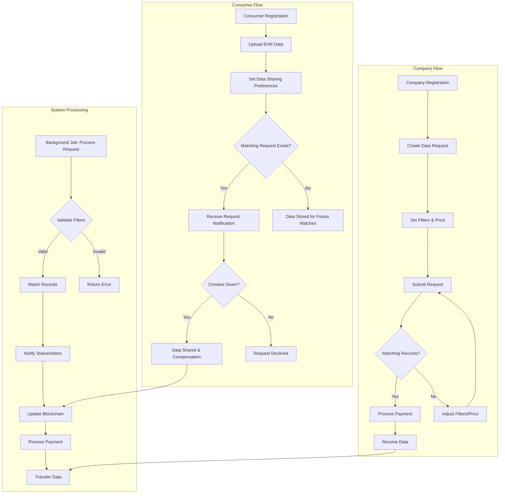
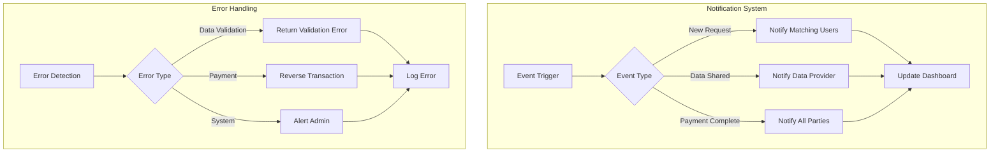
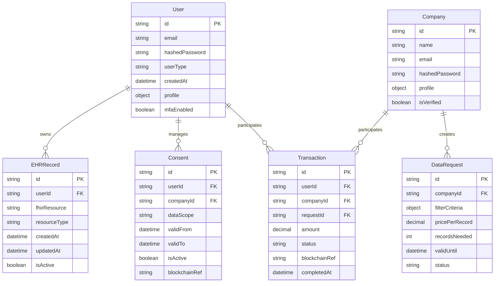
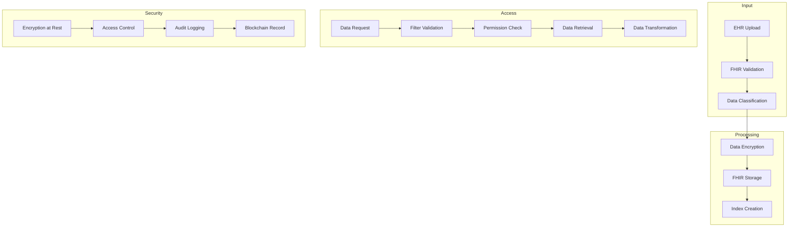

# Product Requirements Document (PRD)

# 1. INTRODUCTION

## 1.1 Purpose
This Product Requirements Document (PRD) specifies the functional and non-functional requirements for MyElixir, an EHR Data Marketplace built on Medplum. This document serves as a comprehensive guide for:
- Development teams implementing the system
- Project managers overseeing development
- Stakeholders validating system requirements
- Quality assurance teams testing the implementation
- System architects designing the technical infrastructure

## 1.2 Scope
MyElixir is a secure healthcare data marketplace that enables individuals to control and monetize their electronic health records (EHR) while providing companies with streamlined access to verified health data. The system encompasses:

### Core Functionalities
- EHR data management through FHIR integration with Medplum
- Granular consent management system
- Real-time marketplace for health data transactions
- Blockchain-based transaction tracking using Hyperledger Fabric
- User and company portals with dedicated dashboards

### Key Benefits
- Empowers individuals to maintain control over their health data
- Provides transparent compensation for data sharing
- Enables companies to access verified health records
- Ensures HIPAA/GDPR compliance
- Facilitates secure and auditable data transactions

### System Boundaries
- User authentication and profile management
- EHR data storage and retrieval via Medplum
- Consent management and access control
- Marketplace operations and bidding system
- Payment processing and compensation tracking
- Data filtering and matching system
- Notification and background job processing

# 2. PRODUCT DESCRIPTION

## 2.1 Product Perspective
MyElixir operates as a standalone EHR data marketplace while integrating with several key external systems:

- Medplum FHIR Server: Provides the core health data storage and standardization
- Hyperledger Fabric Network: Manages transaction tracking and smart contracts
- Azure Cloud Infrastructure: Hosts the entire platform and provides security services
- Payment Processing Systems: Handles monetary transactions for data sharing

The system architecture follows a microservices pattern deployed on Azure Kubernetes Service with the following components:

- Frontend Portal: React.js-based web application
- Backend Services: Node.js + Express microservices
- Data Layer: Medplum FHIR storage and MongoDB
- Blockchain Layer: Hyperledger Fabric network
- Integration Layer: REST APIs and GraphQL endpoints

## 2.2 Product Functions
The primary functions of MyElixir include:

### Consumer Functions
- EHR data upload and management through FHIR
- Granular consent management for data sharing
- Real-time compensation tracking
- Health data visualization
- Personal dashboard for data sharing history

### Company Functions
- Data request creation with filtering criteria
- Automated matching of records to requests
- Secure access to purchased health records
- Request management dashboard
- Payment processing for data access

### System Functions
- Automated record matching based on filter criteria
- Real-time notifications for all stakeholders
- Blockchain-based transaction logging
- HIPAA/GDPR compliant data handling
- Audit trail maintenance

## 2.3 User Characteristics

### Individual Data Providers
- Age Range: 18+ years
- Technical Proficiency: Basic to intermediate
- Motivation: Desire to monetize personal health data
- Access Frequency: Monthly to quarterly
- Primary Concerns: Privacy, security, and fair compensation

### Healthcare Companies
- Types: Research organizations, pharmaceutical companies, healthcare providers
- Technical Proficiency: Intermediate to advanced
- Usage Pattern: Regular, high-volume data requests
- Primary Concerns: Data quality, compliance, and efficient access
- Required Knowledge: HIPAA regulations, FHIR standards

### System Administrators
- Technical Proficiency: Expert level
- Background: Healthcare IT and data management
- Responsibilities: Platform maintenance and support
- Required Knowledge: FHIR, Blockchain, Cloud Infrastructure

## 2.4 Constraints

### Technical Constraints
- Must integrate with Medplum FHIR server
- Azure cloud infrastructure requirements
- Hyperledger Fabric compatibility
- Mobile-responsive web design requirements
- Browser compatibility requirements

### Regulatory Constraints
- HIPAA compliance requirements
- GDPR compliance for EU users
- Data residency requirements
- Audit trail maintenance requirements
- Consent management regulations

### Operational Constraints
- 99.9% system availability requirement
- Maximum 2-second response time for user interactions
- Support for minimum 100,000 concurrent users
- Data backup and recovery requirements
- Maximum 1-hour recovery time objective (RTO)

## 2.5 Assumptions and Dependencies

### Assumptions
- Users have access to modern web browsers
- Companies have valid healthcare data usage licenses
- Internet connectivity is available to all users
- Users can provide valid identification for verification
- Companies can process electronic payments

### Dependencies
- Medplum FHIR server availability
- Azure cloud services reliability
- Hyperledger Fabric network stability
- Third-party payment processing services
- Identity verification services
- Email notification services
- SSL certificate providers

# 3. PROCESS FLOWCHART

```mermaid
flowchart TD
    subgraph Data Processing Pipeline
        A1[Incoming EHR Data] --> B1[Medplum FHIR Server]
        B1 --> C1[Data Validation]
        C1 --> D1[Data Classification]
        D1 --> E1[Store in FHIR Format]
    end

    subgraph Consent Management
        A2[Consent Request] --> B2[Validate Permissions]
        B2 --> C2[Create Smart Contract]
        C2 --> D2[Record on Blockchain]
        D2 --> E2[Update Access Control]
    end

    subgraph Transaction Processing
        A3[Payment Initiated] --> B3[Validate Transaction]
        B3 --> C3[Process Payment]
        C3 --> D3[Record on Blockchain]
        D3 --> E3[Distribute Compensation]
    end
```

# 4. FUNCTIONAL REQUIREMENTS

## 4.1 Authentication and User Management

### ID: F-AUTH
### Description
Secure user authentication and profile management system supporting both consumer and company accounts.
### Priority: High
### Requirements

| ID | Requirement | User Story |
|---|---|---|
| F-AUTH-1 | Support registration for both consumers and companies | As a user, I want to create an account with my email and password |
| F-AUTH-2 | Implement Multi-Factor Authentication (MFA) | As a user, I want to secure my account with 2FA |
| F-AUTH-3 | Enable profile management and updates | As a user, I want to update my profile information |
| F-AUTH-4 | Provide session management | As a user, I want to remain logged in across sessions |
| F-AUTH-5 | Support password reset functionality | As a user, I want to reset my forgotten password |

## 4.2 EHR Data Management

### ID: F-EHR
### Description
FHIR-based health record management system integrated with Medplum.
### Priority: High
### Requirements

| ID | Requirement | User Story |
|---|---|---|
| F-EHR-1 | Enable EHR data upload via FHIR | As a consumer, I want to upload my health records |
| F-EHR-2 | Provide FHIR data validation | As a system admin, I want to ensure data quality |
| F-EHR-3 | Support data visualization | As a consumer, I want to view my health data |
| F-EHR-4 | Enable data export functionality | As a consumer, I want to download my health records |
| F-EHR-5 | Maintain data version history | As a system admin, I want to track data changes |

## 4.3 Consent Management

### ID: F-CONS
### Description
Granular consent management system with blockchain integration.
### Priority: High
### Requirements

| ID | Requirement | User Story |
|---|---|---|
| F-CONS-1 | Enable granular data sharing permissions | As a consumer, I want to control which data is shared |
| F-CONS-2 | Support time-based access control | As a consumer, I want to set time limits on data access |
| F-CONS-3 | Record consent on blockchain | As a system admin, I want immutable consent records |
| F-CONS-4 | Provide consent history tracking | As a consumer, I want to view my consent history |
| F-CONS-5 | Allow consent revocation | As a consumer, I want to revoke data access |

## 4.4 Marketplace Operations

### ID: F-MARK
### Description
Data request and matching system with compensation tracking.
### Priority: High
### Requirements

| ID | Requirement | User Story |
|---|---|---|
| F-MARK-1 | Support data request creation | As a company, I want to create data requests |
| F-MARK-2 | Enable filter criteria definition | As a company, I want to set specific data filters |
| F-MARK-3 | Implement automated record matching | As a system admin, I want to match records to requests |
| F-MARK-4 | Process compensation payments | As a consumer, I want to receive payment for shared data |
| F-MARK-5 | Track marketplace transactions | As a system admin, I want to monitor all transactions |

## 4.5 Notification System

### ID: F-NOTF
### Description
Real-time notification system for all platform events.
### Priority: Medium
### Requirements

| ID | Requirement | User Story |
|---|---|---|
| F-NOTF-1 | Send request match notifications | As a consumer, I want to know about matching requests |
| F-NOTF-2 | Alert on data sharing events | As a company, I want to know when data is shared |
| F-NOTF-3 | Notify on payment completion | As a consumer, I want to know when I receive payment |
| F-NOTF-4 | Support email notifications | As a user, I want to receive email updates |
| F-NOTF-5 | Provide in-platform alerts | As a user, I want to see notifications in my dashboard |

## 4.6 Dashboard and Analytics

### ID: F-DASH
### Description
User-specific dashboards with analytics and reporting.
### Priority: Medium
### Requirements

| ID | Requirement | User Story |
|---|---|---|
| F-DASH-1 | Display sharing history | As a consumer, I want to see my data sharing history |
| F-DASH-2 | Show compensation analytics | As a consumer, I want to track my earnings |
| F-DASH-3 | Present request statistics | As a company, I want to view request performance |
| F-DASH-4 | Generate activity reports | As a user, I want to export activity reports |
| F-DASH-5 | Visualize marketplace trends | As a company, I want to see market trends |

# 5. NON-FUNCTIONAL REQUIREMENTS

## 5.1 Performance Requirements

| ID | Category | Requirement | Metric |
|---|---|---|---|
| NFR-P1 | Response Time | API endpoint response time | < 2 seconds for 95% of requests |
| NFR-P2 | Throughput | Concurrent user support | 100,000 simultaneous users |
| NFR-P3 | Database | FHIR query performance | < 1 second for standard queries |
| NFR-P4 | Resource Usage | CPU utilization | < 70% under normal load |
| NFR-P5 | Memory | Memory usage per container | < 2GB per microservice |
| NFR-P6 | Network | Bandwidth utilization | < 80% of available capacity |

## 5.2 Safety Requirements

| ID | Category | Requirement | Implementation |
|---|---|---|---|
| NFR-S1 | Data Backup | Automated daily backups | Azure Backup with 30-day retention |
| NFR-S2 | Disaster Recovery | Recovery Time Objective (RTO) | < 1 hour |
| NFR-S3 | Recovery Point | Recovery Point Objective (RPO) | < 15 minutes |
| NFR-S4 | Failover | Automatic failover capability | Azure availability zones |
| NFR-S5 | Data Integrity | Checksums for data validation | SHA-256 hash verification |
| NFR-S6 | Error Handling | Graceful degradation | Fallback mechanisms for all critical services |

## 5.3 Security Requirements

| ID | Category | Requirement | Implementation |
|---|---|---|---|
| NFR-SE1 | Authentication | Multi-factor authentication | Azure AD B2C with MFA |
| NFR-SE2 | Authorization | Role-based access control | JWT tokens with granular permissions |
| NFR-SE3 | Encryption | Data encryption at rest | AES-256 encryption |
| NFR-SE4 | Network Security | TLS/SSL implementation | TLS 1.3 with strong ciphers |
| NFR-SE5 | Audit | Security event logging | Azure Monitor integration |
| NFR-SE6 | Key Management | Secure key storage | Azure Key Vault |
| NFR-SE7 | DDoS Protection | DDoS mitigation | Azure DDoS Protection Standard |

## 5.4 Quality Requirements

### 5.4.1 Availability
- System uptime: 99.9% excluding planned maintenance
- Maximum planned downtime: 4 hours per month
- Redundancy across multiple availability zones

### 5.4.2 Maintainability
- Modular architecture with microservices
- Automated deployment pipelines
- Comprehensive API documentation
- Code coverage minimum 80%

### 5.4.3 Usability
- Mobile-responsive design
- Maximum 3 clicks to reach any feature
- Support for major browsers (Chrome, Firefox, Safari, Edge)
- WCAG 2.1 Level AA compliance

### 5.4.4 Scalability
- Horizontal scaling capability
- Auto-scaling based on CPU/memory metrics
- Database sharding support
- Load balancing across multiple regions

### 5.4.5 Reliability
- Mean Time Between Failures (MTBF): > 720 hours
- Mean Time To Recovery (MTTR): < 1 hour
- Error rate: < 0.1% of all transactions
- Automated health checks every 5 minutes

## 5.5 Compliance Requirements

| ID | Category | Requirement | Implementation |
|---|---|---|---|
| NFR-C1 | HIPAA | PHI protection standards | Encryption, access controls, audit logs |
| NFR-C2 | GDPR | Data privacy compliance | Consent management, data portability |
| NFR-C3 | HITECH | Security breach notification | Automated incident response |
| NFR-C4 | FHIR | FHIR R4 compliance | Medplum FHIR server implementation |
| NFR-C5 | SOC 2 | Security controls | Regular audits and reporting |
| NFR-C6 | Data Residency | Geographic data storage | Azure region-specific deployment |
| NFR-C7 | Audit Trail | Transaction logging | Hyperledger Fabric immutable logs |

# 6. DATA REQUIREMENTS

## 6.1 Data Models

## 6.2 Data Storage

### 6.2.1 Primary Storage
- FHIR data stored in Medplum FHIR server
- Structured metadata in MongoDB collections
- Blockchain transactions in Hyperledger Fabric

### 6.2.2 Data Retention
| Data Type | Retention Period | Storage Location |
|-----------|-----------------|------------------|
| EHR Records | 7 years | Medplum FHIR Server |
| User Profiles | Account lifetime + 1 year | MongoDB |
| Consent Records | 10 years | MongoDB + Blockchain |
| Transaction History | Permanent | Blockchain |
| Audit Logs | 7 years | Azure Monitor |

### 6.2.3 Backup Strategy
| Component | Frequency | Method | Retention |
|-----------|-----------|--------|-----------|
| FHIR Data | Daily | Azure Backup | 30 days |
| MongoDB | Hourly | Azure Cosmos DB Backup | 7 days |
| Blockchain | Continuous | Hyperledger State DB Backup | 90 days |
| Configuration | Weekly | Azure Site Recovery | 90 days |

### 6.2.4 Data Redundancy
- Geographic replication across Azure regions
- Multi-zone deployment within regions
- Hot-standby FHIR server instance
- MongoDB replica sets with 3 nodes

## 6.3 Data Processing

### 6.3.1 Data Security Controls
| Layer | Security Measure | Implementation |
|-------|-----------------|----------------|
| Transport | TLS 1.3 | Azure Application Gateway |
| Storage | AES-256 | Azure Storage Encryption |
| Application | Field-level encryption | Custom encryption service |
| Database | Transparent data encryption | Azure SQL TDE |
| Backup | Encrypted backups | Azure Backup encryption |

### 6.3.2 Data Transformation Rules
| Source Format | Target Format | Transformation |
|--------------|---------------|----------------|
| Legacy EHR | FHIR R4 | Medplum Data Mapper |
| FHIR | Company Format | Custom ETL Pipeline |
| Blockchain Data | Analytics Format | Data Lake Transform |

### 6.3.3 Data Quality Requirements
| Metric | Threshold | Validation Method |
|--------|-----------|------------------|
| FHIR Compliance | 100% | Medplum Validator |
| Data Completeness | 95% | Custom Validation Rules |
| Record Accuracy | 99.99% | Automated Verification |
| Duplicate Detection | < 0.1% | Hash Comparison |

# 7. EXTERNAL INTERFACES

## 7.1 User Interfaces

### 7.1.1 Consumer Portal
- Responsive web interface built with React.js
- Minimum supported screen resolution: 1280x720
- Support for mobile devices (iOS/Android) through responsive design
- WCAG 2.1 Level AA compliance for accessibility

| Interface Component | Description | Primary Functions |
|---|---|---|
| Dashboard | Personal health data overview | Data visualization, sharing history, compensation tracking |
| EHR Management | Health record interface | Upload, view, and manage FHIR records |
| Consent Center | Permission management | Grant/revoke access, view consent history |
| Marketplace | Data sharing opportunities | View requests, manage permissions, track earnings |

### 7.1.2 Company Portal
- Enterprise-focused web interface
- Support for large screen formats (1920x1080 and above)
- Data visualization components for analytics
- Batch operation capabilities

| Interface Component | Description | Primary Functions |
|---|---|---|
| Request Dashboard | Data request management | Create/monitor requests, view matches |
| Analytics Center | Data insights interface | View statistics, generate reports |
| Data Access | Record viewing interface | Access purchased records, export data |
| Payment Portal | Transaction management | Process payments, view history |

## 7.2 Hardware Interfaces

### 7.2.1 Cloud Infrastructure
| Component | Specification | Purpose |
|---|---|---|
| Azure AKS Nodes | Standard_D4s_v3 (4 vCPU, 16GB RAM) | Application hosting |
| Load Balancers | Azure Load Balancer Premium | Traffic distribution |
| Storage | Azure Premium SSD | High-performance storage |
| Network | Azure Virtual Network | Secure communication |

### 7.2.2 Client Requirements
| Device Type | Minimum Requirements |
|---|---|
| Desktop/Laptop | Modern CPU, 4GB RAM, HTML5 capable browser |
| Mobile Devices | iOS 14+ or Android 8+ |
| Network | 5 Mbps broadband connection |

## 7.3 Software Interfaces

### 7.3.1 Medplum FHIR Integration
| Interface | Protocol | Data Format |
|---|---|---|
| FHIR API | REST/HTTPS | FHIR R4 JSON |
| Authentication | OAuth 2.0 | JWT Tokens |
| Webhooks | HTTPS | JSON Payloads |

### 7.3.2 Hyperledger Fabric
| Interface | Protocol | Purpose |
|---|---|---|
| Chain Code API | gRPC | Smart contract execution |
| Event Hub | WebSocket | Real-time updates |
| Query API | REST/HTTPS | Transaction queries |

### 7.3.3 Azure Services
| Service | Interface Type | Purpose |
|---|---|---|
| Azure AD B2C | REST/HTTPS | Authentication |
| Key Vault | REST/HTTPS | Secret management |
| Monitor | REST/HTTPS | Logging and metrics |
| Container Registry | Docker API | Image management |

## 7.4 Communication Interfaces

### 7.4.1 API Protocols
| Protocol | Usage | Security |
|---|---|---|
| HTTPS | REST API calls | TLS 1.3 |
| WebSocket | Real-time updates | WSS protocol |
| GraphQL | Data queries | TLS 1.3 |

### 7.4.2 Integration Endpoints
| Endpoint Type | Format | Rate Limit |
|---|---|---|
| REST APIs | JSON/XML | 1000 req/min |
| FHIR APIs | FHIR JSON | 500 req/min |
| WebSocket | JSON | 100 msg/sec |

### 7.4.3 Notification Services
| Channel | Protocol | Format |
|---|---|---|
| Email | SMTP/TLS | HTML/Text |
| In-App | WebSocket | JSON |
| SMS | HTTP/HTTPS | Text |

### 7.4.4 Data Exchange Formats
| Type | Format | Validation |
|---|---|---|
| Health Records | FHIR R4 | FHIR Validator |
| Blockchain Data | JSON | Schema Validation |
| Analytics Data | CSV/JSON | Data Quality Rules |

# 8. APPENDICES

## 8.1 ADDITIONAL INFORMATION

### 8.1.1 Background Job Details
| Job Name | Frequency | Description |
|----------|-----------|-------------|
| process-request | On-demand | Matches consumer records to company request filters |
| notify-consumer-request | Real-time | Alerts consumers about matching data requests |
| notify-consumer-data-shared | Real-time | Confirms data sharing with companies |
| notify-company-request-met | Real-time | Informs companies when requests are fulfilled |

### 8.1.2 Filter Criteria Categories
| Category | Examples | Implementation |
|----------|----------|----------------|
| Demographic | Age, Gender, Location | FHIR Patient Resource |
| Physiological | Conditions, Vitals, Lab Results | FHIR Observation Resource |
| Medical History | Procedures, Medications | FHIR Condition Resource |
| Insurance | Coverage, Claims | FHIR Coverage Resource |

## 8.2 GLOSSARY

| Term | Definition |
|------|------------|
| EHR | Electronic Health Record - Digital version of a patient's medical history |
| Data Provider | Individual user sharing their health records on the platform |
| Data Consumer | Company requesting access to health records |
| Smart Contract | Self-executing contract with terms directly written into code |
| Data Marketplace | Platform where health data is exchanged between providers and consumers |
| Consent Engine | System managing granular permissions for data sharing |
| Filter Criteria | Specific conditions used to match health records with requests |

## 8.3 ACRONYMS

| Acronym | Full Form |
|---------|-----------|
| API | Application Programming Interface |
| FHIR | Fast Healthcare Interoperability Resources |
| HIPAA | Health Insurance Portability and Accountability Act |
| GDPR | General Data Protection Regulation |
| MFA | Multi-Factor Authentication |
| JWT | JSON Web Token |
| AKS | Azure Kubernetes Service |
| TLS | Transport Layer Security |
| REST | Representational State Transfer |
| WCAG | Web Content Accessibility Guidelines |

## 8.4 ADDITIONAL REFERENCES

### 8.4.1 Technical Standards
- HL7 FHIR R4 Specification: [http://hl7.org/fhir/R4/](http://hl7.org/fhir/R4/)
- Hyperledger Fabric Documentation: [https://hyperledger-fabric.readthedocs.io/](https://hyperledger-fabric.readthedocs.io/)
- Medplum API Documentation: [https://docs.medplum.com/](https://docs.medplum.com/)
- Azure Cloud Documentation: [https://docs.microsoft.com/azure/](https://docs.microsoft.com/azure/)

### 8.4.2 Regulatory Guidelines
- HIPAA Security Rule: [https://www.hhs.gov/hipaa/for-professionals/security/](https://www.hhs.gov/hipaa/for-professionals/security/)
- GDPR Requirements: [https://gdpr.eu/](https://gdpr.eu/)
- HITECH Act: [https://www.hhs.gov/hipaa/for-professionals/special-topics/hitech-act-enforcement-interim-final-rule/](https://www.hhs.gov/hipaa/for-professionals/special-topics/hitech-act-enforcement-interim-final-rule/)

### 8.4.3 Development Resources
- React.js Documentation: [https://reactjs.org/docs/](https://reactjs.org/docs/)
- Node.js Documentation: [https://nodejs.org/docs/](https://nodejs.org/docs/)
- MongoDB Documentation: [https://docs.mongodb.com/](https://docs.mongodb.com/)
- GraphQL Documentation: [https://graphql.org/learn/](https://graphql.org/learn/)