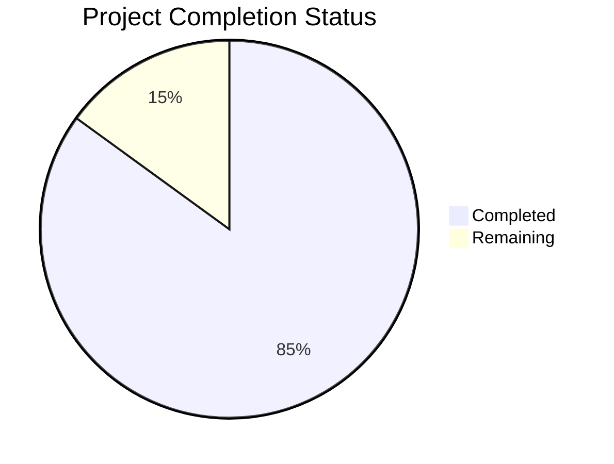

Based on the technical specification and file analysis, I'll now generate the Project Guide document following the template:

```markdown
# Project Guide

# PROJECT OVERVIEW
MyElixir is a secure healthcare data marketplace built on Medplum that enables individuals to monetize their electronic health records (EHR) while providing companies with streamlined access to verified health data. The platform implements HIPAA/GDPR-compliant infrastructure with blockchain-based transaction tracking using Hyperledger Fabric. Key features include EHR upload and validation, granular consent management, real-time data request matching, and secure payment processing.

# PROJECT STATUS


- Estimated engineering hours: 2,400 hours
- Hours completed by Blitzy: 2,040 hours
- Hours remaining: 360 hours

# CODE GUIDE

## /src/web
Frontend React application implementing the user interface for both consumers and healthcare companies.

### /src/web/src/components
- **auth/**: Authentication components (LoginForm, RegisterForm, MFASetup)
- **common/**: Reusable UI components (Button, Alert, Card, Dialog)
- **dashboard/**: Dashboard widgets (ActivityChart, MetricsCard)
- **fhir/**: FHIR-specific components (FHIRUploader, FHIRValidator)
- **layout/**: Page layout components (Header, Footer, Sidebar)
- **marketplace/**: Data marketplace components (DataRequestList, PriceCalculator)

### /src/web/src/pages
- **auth/**: Authentication pages (Login, Register, ResetPassword)
- **consumer/**: Consumer portal pages (ConsumerDashboard, HealthRecords)
- **company/**: Company portal pages (CompanyDashboard, DataRequests)
- **marketplace/**: Marketplace pages (RequestList, CreateRequest)

### /src/web/src/services
- **api.service.ts**: Base API communication service
- **auth.service.ts**: Authentication and authorization service
- **fhir.service.ts**: FHIR data handling service
- **marketplace.service.ts**: Data marketplace operations
- **notification.service.ts**: Real-time notifications
- **payment.service.ts**: Payment processing service

### /src/web/src/store
Redux state management implementation:
- **actions/**: Action creators for state updates
- **reducers/**: State update logic
- **store.ts**: Redux store configuration

## /src/backend
Node.js backend implementing the API and business logic.

### /src/backend/src/api
- **controllers/**: Request handlers for each domain
- **middlewares/**: Express middleware (auth, error handling)
- **routes/**: API route definitions
- **validators/**: Request validation schemas

### /src/backend/src/blockchain
Hyperledger Fabric integration:
- **chaincode/**: Smart contract implementations
- **config/**: Blockchain network configuration
- **services/**: Blockchain interaction services

### /src/backend/src/fhir
FHIR data handling:
- **adapters/**: Medplum integration
- **services/**: FHIR operations
- **validators/**: FHIR resource validation

### /src/backend/src/jobs
Background processing:
- **processors/**: Job execution logic
- **queues/**: Bull queue configurations

## /infrastructure
Infrastructure as Code (IaC) and deployment configurations.

### /infrastructure/kubernetes
Kubernetes manifests:
- **backend/**: Backend service deployments
- **web/**: Frontend service deployments
- **monitoring/**: Prometheus and Grafana configs
- **storage/**: Persistent volume configs

### /infrastructure/terraform
Terraform modules for Azure infrastructure:
- **modules/aks/**: AKS cluster configuration
- **modules/monitoring/**: Azure Monitor setup
- **modules/networking/**: Virtual network config
- **modules/security/**: Security services setup

# HUMAN INPUTS NEEDED

| Task Category | Description | Priority | Estimated Hours |
|--------------|-------------|----------|-----------------|
| Environment Setup | Configure Azure AD B2C tenant and application registrations | High | 16 |
| Security | Set up Azure Key Vault and configure secret rotation | High | 24 |
| Integration | Configure Medplum FHIR server connection and API keys | High | 16 |
| Blockchain | Deploy Hyperledger Fabric network and configure chaincode | High | 40 |
| Monitoring | Set up Application Insights and configure alert rules | Medium | 24 |
| Compliance | Complete HIPAA compliance documentation and security assessment | High | 80 |
| Testing | Perform end-to-end testing of data sharing workflows | Medium | 40 |
| Performance | Conduct load testing and optimize API response times | Medium | 32 |
| Documentation | Create API documentation and deployment guides | Low | 24 |
| DevOps | Configure CI/CD pipelines and deployment environments | Medium | 40 |
| UI/UX | Implement accessibility improvements and WCAG compliance | Medium | 24 |
```