# Technical Specifications

# 1. INTRODUCTION

## 1.1 EXECUTIVE SUMMARY

MyElixir is a secure healthcare data marketplace built on Medplum that revolutionizes how individuals monetize their electronic health records (EHR) while providing companies with streamlined access to verified health data. The platform addresses the critical challenge of enabling transparent, secure, and compliant health data sharing between individuals and healthcare organizations.

The system serves two primary stakeholder groups: individuals seeking to control and monetize their health data, and healthcare companies requiring access to verified health records for research and development. By implementing HIPAA/GDPR-compliant infrastructure with blockchain-based transaction tracking, MyElixir creates a trusted ecosystem that delivers value through transparent compensation for data providers and efficient access for data consumers.

## 1.2 SYSTEM OVERVIEW

### Project Context

| Aspect | Description |
|--------|-------------|
| Market Position | First-to-market FHIR-based health data marketplace with blockchain integration |
| Enterprise Integration | Seamless integration with Medplum FHIR server and existing healthcare systems |
| Technical Innovation | Combines FHIR standards, blockchain security, and real-time marketplace capabilities |

### High-Level Description

| Component | Implementation |
|-----------|----------------|
| User Management | Azure AD B2C with MFA support |
| Data Storage | Medplum FHIR server with HIPAA compliance |
| Consent System | Hyperledger Fabric smart contracts |
| Marketplace | Real-time bidding and matching system |
| Infrastructure | Azure Kubernetes Service (AKS) deployment |

### Success Criteria

| Category | Metrics |
|----------|---------|
| Platform Adoption | 100,000 active users within first year |
| Data Quality | 99.9% FHIR validation success rate |
| System Performance | 99.9% uptime, <2s response time |
| Security Compliance | Zero HIPAA/GDPR violations |

## 1.3 SCOPE

### In-Scope Elements

#### Core Features and Functionalities

| Feature Category | Capabilities |
|-----------------|--------------|
| Data Management | EHR upload, FHIR validation, data visualization |
| Consent Control | Granular permissions, time-based access, blockchain tracking |
| Marketplace | Data requests, automated matching, compensation processing |
| Security | End-to-end encryption, audit logging, MFA |

#### Implementation Boundaries

| Boundary Type | Coverage |
|--------------|----------|
| User Groups | Individual data providers, healthcare companies |
| Geographic Scope | Global deployment with region-specific compliance |
| Data Domains | Electronic health records in FHIR R4 format |
| Integration Points | Medplum, Hyperledger, Azure services |

### Out-of-Scope Elements

| Category | Excluded Items |
|----------|----------------|
| Features | Direct patient care functionality, medical device integration |
| Data Types | Non-FHIR health records, real-time medical device data |
| Integrations | Legacy EMR systems, insurance claim processing |
| Use Cases | Clinical decision support, real-time monitoring |

# 2. SYSTEM ARCHITECTURE

## 2.1 High-Level Architecture

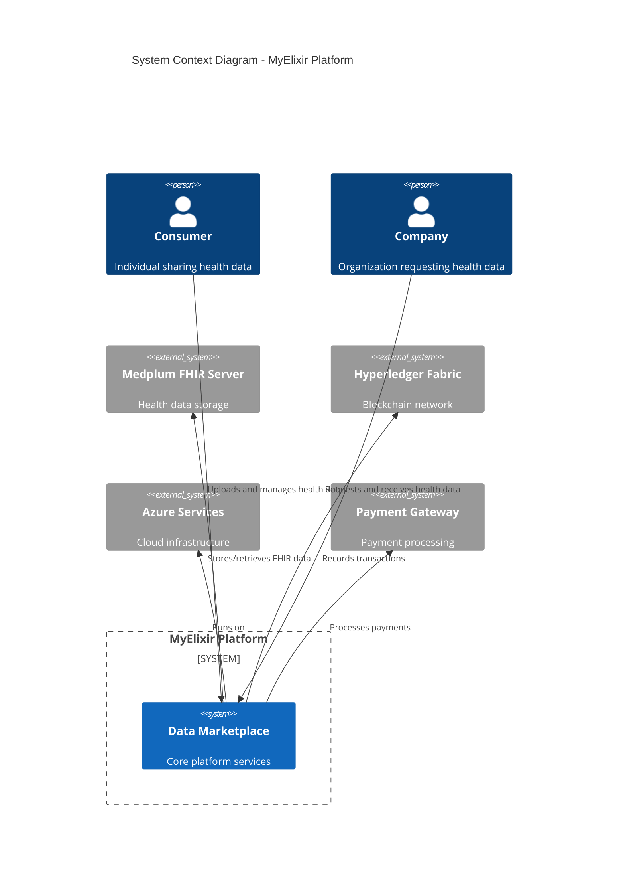
```mermaid
C4Context
    title System Context Diagram - MyElixir Platform

    Person(consumer, "Consumer", "Individual sharing health data")
    Person(company, "Company", "Organization requesting health data")
    
    System_Boundary(myElixir, "MyElixir Platform") {
        System(marketplace, "Data Marketplace", "Core platform services")
    }

    System_Ext(medplum, "Medplum FHIR Server", "Health data storage")
    System_Ext(hyperledger, "Hyperledger Fabric", "Blockchain network")
    System_Ext(azure, "Azure Services", "Cloud infrastructure")
    System_Ext(payment, "Payment Gateway", "Payment processing")

    Rel(consumer, marketplace, "Uploads and manages health data")
    Rel(company, marketplace, "Requests and receives health data")
    Rel(marketplace, medplum, "Stores/retrieves FHIR data")
    Rel(marketplace, hyperledger, "Records transactions")
    Rel(marketplace, azure, "Runs on")
    Rel(marketplace, payment, "Processes payments")
```

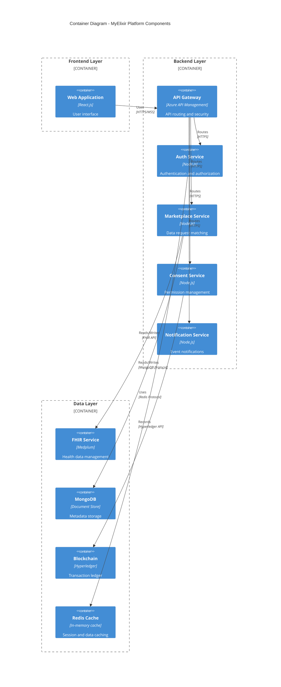
```mermaid
C4Container
    title Container Diagram - MyElixir Platform Components

    Container_Boundary(frontend, "Frontend Layer") {
        Container(web, "Web Application", "React.js", "User interface")
    }

    Container_Boundary(backend, "Backend Layer") {
        Container(api, "API Gateway", "Azure API Management", "API routing and security")
        Container(auth, "Auth Service", "Node.js", "Authentication and authorization")
        Container(marketplace, "Marketplace Service", "Node.js", "Data request matching")
        Container(consent, "Consent Service", "Node.js", "Permission management")
        Container(notification, "Notification Service", "Node.js", "Event notifications")
    }

    Container_Boundary(data, "Data Layer") {
        Container(fhir, "FHIR Service", "Medplum", "Health data management")
        Container(mongo, "MongoDB", "Document Store", "Metadata storage")
        Container(blockchain, "Blockchain", "Hyperledger", "Transaction ledger")
        Container(cache, "Redis Cache", "In-memory cache", "Session and data caching")
    }

    Rel(web, api, "Uses", "HTTPS/WSS")
    Rel(api, auth, "Routes", "HTTPS")
    Rel(api, marketplace, "Routes", "HTTPS")
    Rel(api, consent, "Routes", "HTTPS")
    Rel(api, notification, "Routes", "HTTPS")
    
    Rel(marketplace, fhir, "Reads/Writes", "FHIR API")
    Rel(marketplace, mongo, "Reads/Writes", "MongoDB Protocol")
    Rel(consent, blockchain, "Records", "Hyperledger API")
    Rel_R(auth, cache, "Uses", "Redis Protocol")
```

## 2.2 Component Details

### 2.2.1 Frontend Components

| Component | Technology | Purpose | Scaling Strategy |
|-----------|------------|---------|------------------|
| Web Portal | React.js | User interface | CDN distribution |
| State Management | Redux | Client-side data | Browser caching |
| API Client | Axios | Backend communication | Request batching |
| FHIR Viewer | FHIR SDK | Health data display | Lazy loading |

### 2.2.2 Backend Services

| Service | Technology | Responsibilities | Scaling Approach |
|---------|------------|------------------|------------------|
| API Gateway | Azure API Management | Request routing, rate limiting | Horizontal scaling |
| Auth Service | Node.js + Express | Authentication, authorization | Pod replication |
| Marketplace Service | Node.js + Express | Data matching, transactions | Pod replication |
| Consent Service | Node.js + Express | Permission management | Pod replication |
| Notification Service | Node.js + Express | Event distribution | Event-driven scaling |

### 2.2.3 Data Services

| Service | Technology | Purpose | Data Model |
|---------|------------|---------|------------|
| FHIR Server | Medplum | Health record storage | FHIR R4 |
| Document Store | MongoDB | Metadata, user data | Document-based |
| Blockchain | Hyperledger Fabric | Transaction ledger | Chain code |
| Cache | Redis | Session, temporary data | Key-value |

## 2.3 Technical Decisions

### 2.3.1 Architecture Patterns

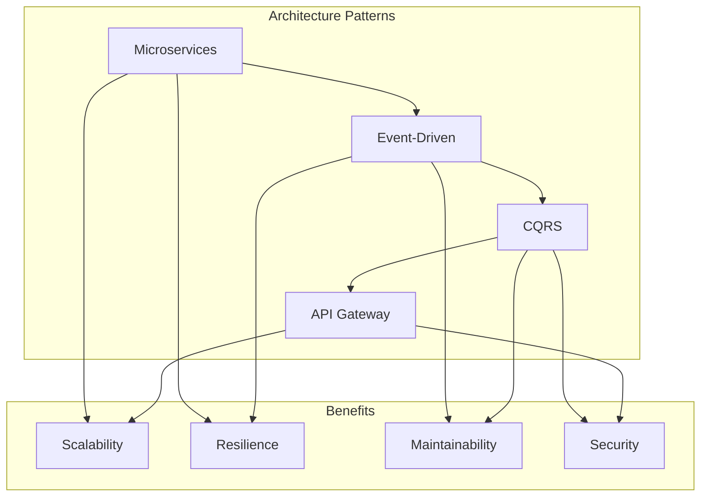
```mermaid
flowchart TD
    subgraph "Architecture Patterns"
        A[Microservices] --> B[Event-Driven]
        B --> C[CQRS]
        C --> D[API Gateway]
    end

    subgraph "Benefits"
        E[Scalability]
        F[Resilience]
        G[Maintainability]
        H[Security]
    end

    A --> E & F
    B --> F & G
    C --> G & H
    D --> H & E
```

### 2.3.2 Communication Patterns

| Pattern | Implementation | Use Case |
|---------|---------------|-----------|
| Synchronous | REST APIs | Direct requests |
| Asynchronous | Message Queue | Background jobs |
| Event-Driven | WebSocket | Real-time updates |
| Pub/Sub | Redis | Notifications |

## 2.4 Cross-Cutting Concerns

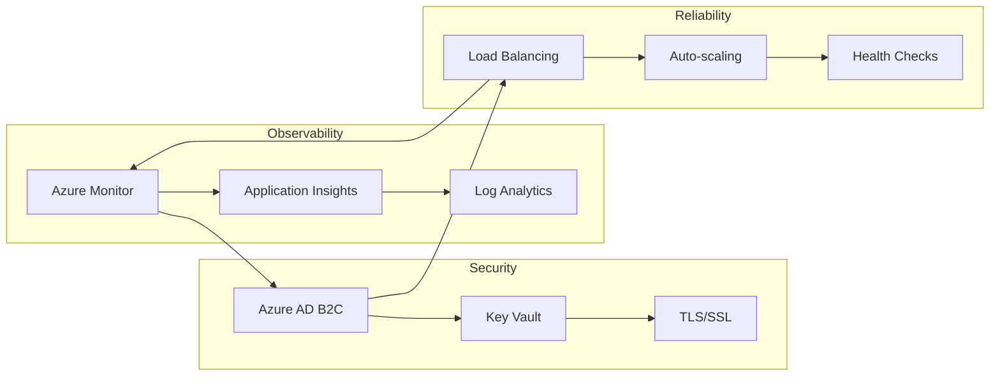
```mermaid
flowchart LR
    subgraph "Observability"
        A[Azure Monitor] --> B[Application Insights]
        B --> C[Log Analytics]
    end

    subgraph "Security"
        D[Azure AD B2C] --> E[Key Vault]
        E --> F[TLS/SSL]
    end

    subgraph "Reliability"
        G[Load Balancing] --> H[Auto-scaling]
        H --> I[Health Checks]
    end

    A --> D
    D --> G
    G --> A
```

### 2.4.1 Deployment Architecture

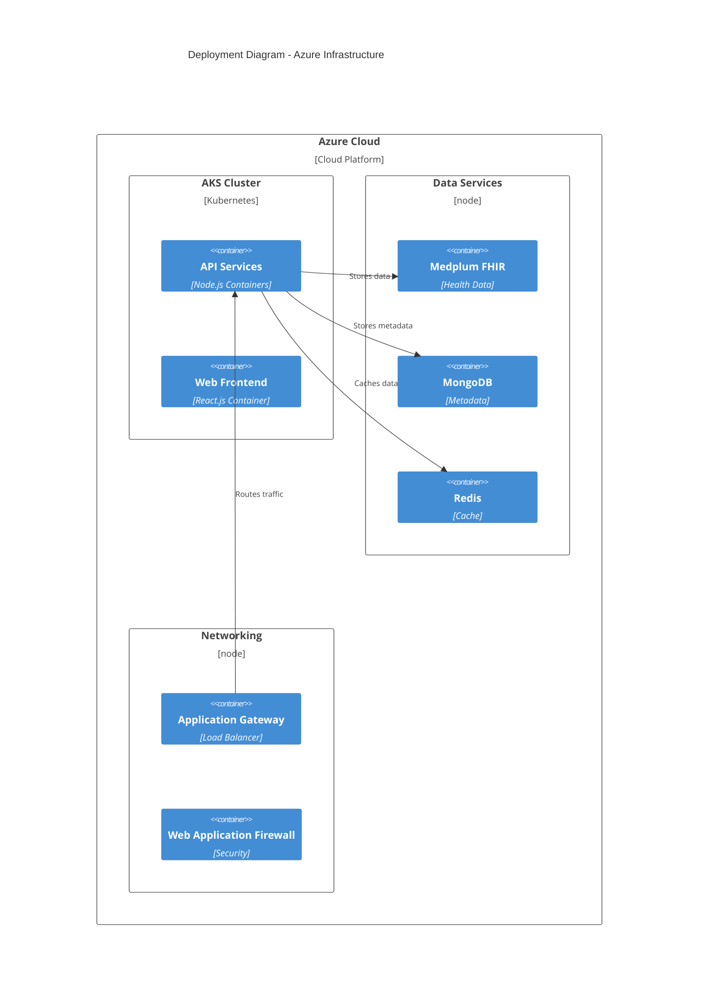
```mermaid
C4Deployment
    title Deployment Diagram - Azure Infrastructure

    Deployment_Node(az, "Azure Cloud", "Cloud Platform") {
        Deployment_Node(aks, "AKS Cluster", "Kubernetes") {
            Container(api, "API Services", "Node.js Containers")
            Container(web, "Web Frontend", "React.js Container")
        }
        
        Deployment_Node(data, "Data Services") {
            Container(med, "Medplum FHIR", "Health Data")
            Container(mdb, "MongoDB", "Metadata")
            Container(rds, "Redis", "Cache")
        }

        Deployment_Node(net, "Networking") {
            Container(agw, "Application Gateway", "Load Balancer")
            Container(waf, "Web Application Firewall", "Security")
        }
    }

    Rel(agw, api, "Routes traffic")
    Rel(api, med, "Stores data")
    Rel(api, mdb, "Stores metadata")
    Rel(api, rds, "Caches data")
```

# 3. SYSTEM COMPONENTS ARCHITECTURE

## 3.1 USER INTERFACE DESIGN

### 3.1.1 Design Specifications

| Category | Requirement | Implementation |
|----------|-------------|----------------|
| Visual Hierarchy | Material Design 3.0 | React Material UI components |
| Component Library | Custom MyElixir Design System | Storybook documentation |
| Responsive Design | Mobile-first approach | Bootstrap 5 grid system |
| Accessibility | WCAG 2.1 Level AA | ARIA labels, semantic HTML |
| Browser Support | Modern browsers, IE11+ | Babel polyfills |
| Theme Support | Light/Dark modes | CSS variables system |
| Internationalization | English, Spanish initial | React-i18next |

### 3.1.2 Interface Elements

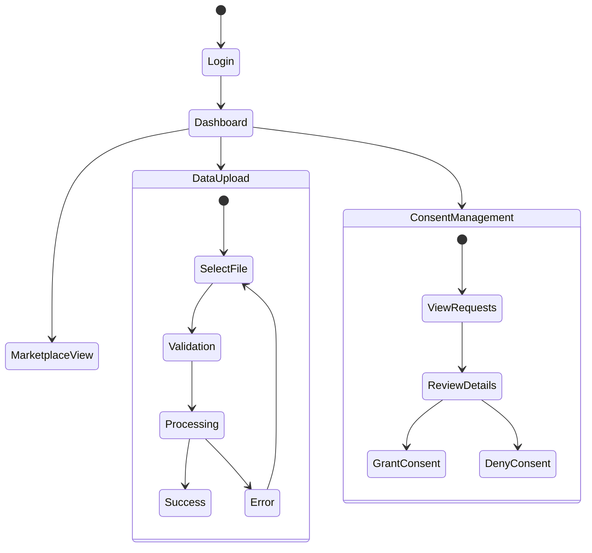
```mermaid
stateDiagram-v2
    [*] --> Login
    Login --> Dashboard
    Dashboard --> DataUpload
    Dashboard --> ConsentManagement
    Dashboard --> MarketplaceView
    
    state DataUpload {
        [*] --> SelectFile
        SelectFile --> Validation
        Validation --> Processing
        Processing --> Success
        Processing --> Error
        Error --> SelectFile
    }
    
    state ConsentManagement {
        [*] --> ViewRequests
        ViewRequests --> ReviewDetails
        ReviewDetails --> GrantConsent
        ReviewDetails --> DenyConsent
    }
```

### 3.1.3 Critical User Flows

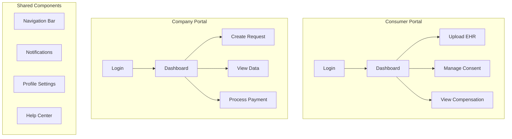
```mermaid
flowchart TD
    subgraph Consumer Portal
        A[Login] --> B[Dashboard]
        B --> C[Upload EHR]
        B --> D[Manage Consent]
        B --> E[View Compensation]
    end

    subgraph Company Portal
        F[Login] --> G[Dashboard]
        G --> H[Create Request]
        G --> I[View Data]
        G --> J[Process Payment]
    end

    subgraph Shared Components
        K[Navigation Bar]
        L[Notifications]
        M[Profile Settings]
        N[Help Center]
    end
```

## 3.2 DATABASE DESIGN

### 3.2.1 Schema Design

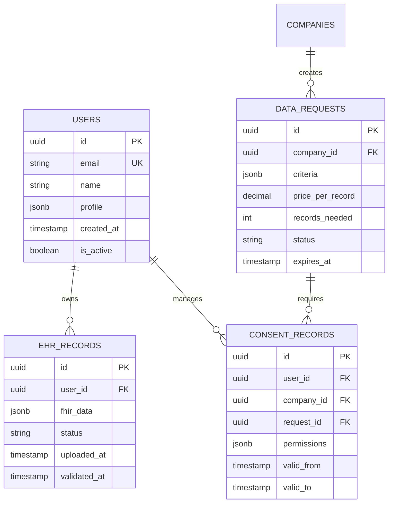
```mermaid
erDiagram
    USERS ||--o{ EHR_RECORDS : owns
    USERS ||--o{ CONSENT_RECORDS : manages
    COMPANIES ||--o{ DATA_REQUESTS : creates
    DATA_REQUESTS ||--o{ CONSENT_RECORDS : requires
    
    USERS {
        uuid id PK
        string email UK
        string name
        jsonb profile
        timestamp created_at
        boolean is_active
    }

    EHR_RECORDS {
        uuid id PK
        uuid user_id FK
        jsonb fhir_data
        string status
        timestamp uploaded_at
        timestamp validated_at
    }

    CONSENT_RECORDS {
        uuid id PK
        uuid user_id FK
        uuid company_id FK
        uuid request_id FK
        jsonb permissions
        timestamp valid_from
        timestamp valid_to
    }

    DATA_REQUESTS {
        uuid id PK
        uuid company_id FK
        jsonb criteria
        decimal price_per_record
        int records_needed
        string status
        timestamp expires_at
    }
```

### 3.2.2 Data Management Strategy

| Aspect | Strategy | Implementation |
|--------|----------|----------------|
| Migration | Incremental updates | Flyway versioning |
| Versioning | Semantic versioning | Database changelog |
| Archival | Cold storage after 2 years | Azure Archive Storage |
| Retention | 7-year minimum | Automated archival process |
| Privacy | Field-level encryption | Azure Always Encrypted |
| Audit | Comprehensive logging | Separate audit schema |

## 3.3 API DESIGN

### 3.3.1 API Architecture

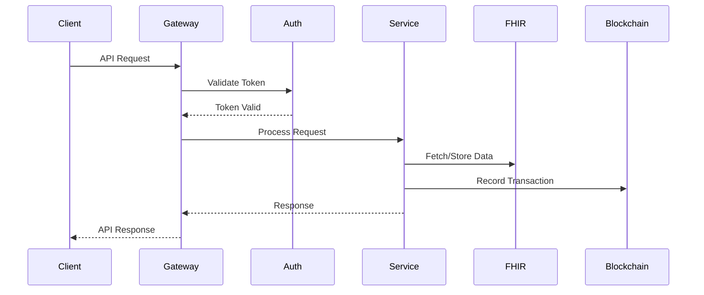
```mermaid
sequenceDiagram
    participant Client
    participant Gateway
    participant Auth
    participant Service
    participant FHIR
    participant Blockchain

    Client->>Gateway: API Request
    Gateway->>Auth: Validate Token
    Auth-->>Gateway: Token Valid
    Gateway->>Service: Process Request
    Service->>FHIR: Fetch/Store Data
    Service->>Blockchain: Record Transaction
    Service-->>Gateway: Response
    Gateway-->>Client: API Response
```

### 3.3.2 Interface Specifications

| Endpoint Category | Authentication | Rate Limit | Caching |
|------------------|----------------|------------|----------|
| Public APIs | API Key | 1000/hour | 5 minutes |
| User APIs | JWT Bearer | 5000/hour | No cache |
| Admin APIs | JWT + MFA | 1000/hour | No cache |
| Health APIs | None | 100/minute | 1 minute |

### 3.3.3 Integration Requirements

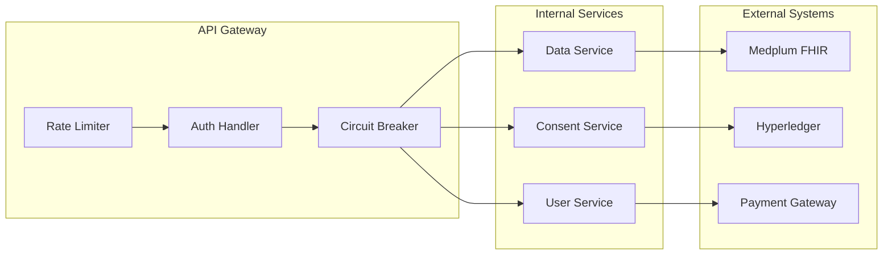
```mermaid
flowchart LR
    subgraph External Systems
        A[Medplum FHIR]
        B[Hyperledger]
        C[Payment Gateway]
    end

    subgraph API Gateway
        D[Rate Limiter]
        E[Auth Handler]
        F[Circuit Breaker]
    end

    subgraph Internal Services
        G[User Service]
        H[Data Service]
        I[Consent Service]
    end

    D --> E
    E --> F
    F --> G & H & I
    H --> A
    I --> B
    G --> C
```

### 3.3.4 Security Controls

| Control Type | Implementation | Validation |
|-------------|----------------|------------|
| Authentication | OAuth 2.0 + PKCE | JWT validation |
| Authorization | RBAC + ABAC | Policy enforcement |
| Encryption | TLS 1.3 | Certificate validation |
| API Security | WAF rules | Request scanning |
| Rate Limiting | Token bucket | Counter verification |
| Input Validation | JSON Schema | Request validation |

# 4. TECHNOLOGY STACK

## 4.1 PROGRAMMING LANGUAGES

| Platform | Language | Version | Justification |
|----------|----------|---------|---------------|
| Backend | Node.js | 18.x LTS | Async I/O performance, extensive healthcare libraries, Medplum SDK support |
| Frontend | TypeScript | 4.9+ | Type safety, enhanced IDE support, React integration |
| Smart Contracts | Go | 1.19+ | Hyperledger Fabric chaincode support, performance |
| Scripts | Python | 3.9+ | Data processing, FHIR validation utilities |

## 4.2 FRAMEWORKS & LIBRARIES

### Backend Frameworks
| Framework | Version | Purpose | Justification |
|-----------|---------|---------|---------------|
| Express.js | 4.18+ | API Server | Proven reliability, middleware ecosystem |
| Medplum SDK | Latest | FHIR Integration | Official Medplum support, FHIR R4 compliance |
| Fabric SDK | 2.2+ | Blockchain Integration | Hyperledger Fabric official support |
| Jest | 29+ | Testing | Comprehensive testing capabilities |

### Frontend Frameworks
| Framework | Version | Purpose | Justification |
|-----------|---------|---------|---------------|
| React | 18+ | UI Framework | Component reusability, FHIR component ecosystem |
| Material UI | 5+ | Component Library | Healthcare-focused components, accessibility |
| Redux Toolkit | 1.9+ | State Management | Predictable state updates, middleware support |
| React Query | 4+ | Data Fetching | FHIR caching, real-time updates |

## 4.3 DATABASES & STORAGE

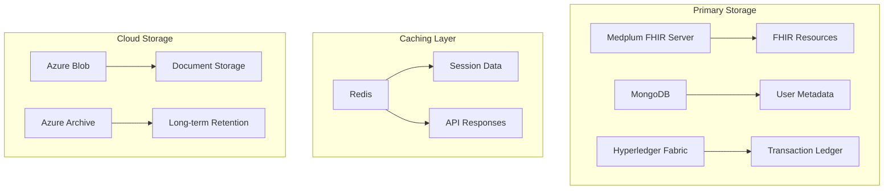
```mermaid
flowchart TD
    subgraph Primary Storage
        A[Medplum FHIR Server] --> B[FHIR Resources]
        C[MongoDB] --> D[User Metadata]
        E[Hyperledger Fabric] --> F[Transaction Ledger]
    end

    subgraph Caching Layer
        G[Redis] --> H[Session Data]
        G --> I[API Responses]
    end

    subgraph Cloud Storage
        J[Azure Blob] --> K[Document Storage]
        L[Azure Archive] --> M[Long-term Retention]
    end
```

### Storage Strategy
| Type | Technology | Purpose | Retention |
|------|------------|---------|-----------|
| FHIR Data | Medplum | Health Records | 7 years |
| Metadata | MongoDB | User/Company Data | Active + 1 year |
| Cache | Redis | Session/API Cache | Temporary |
| Documents | Azure Blob | Uploaded Files | 7 years |
| Archive | Azure Archive | Compliance Data | 10 years |

## 4.4 THIRD-PARTY SERVICES

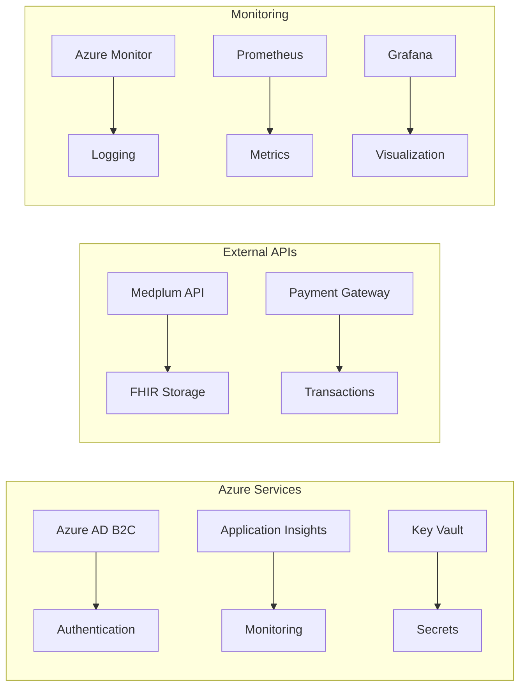
```mermaid
flowchart LR
    subgraph Azure Services
        A[Azure AD B2C] --> B[Authentication]
        C[Application Insights] --> D[Monitoring]
        E[Key Vault] --> F[Secrets]
    end

    subgraph External APIs
        G[Medplum API] --> H[FHIR Storage]
        I[Payment Gateway] --> J[Transactions]
    end

    subgraph Monitoring
        K[Azure Monitor] --> L[Logging]
        M[Prometheus] --> N[Metrics]
        O[Grafana] --> P[Visualization]
    end
```

## 4.5 DEVELOPMENT & DEPLOYMENT

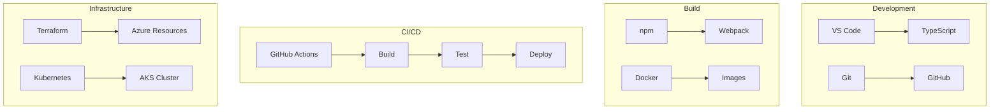
```mermaid
flowchart TD
    subgraph Development
        A[VS Code] --> B[TypeScript]
        C[Git] --> D[GitHub]
    end

    subgraph Build
        E[npm] --> F[Webpack]
        G[Docker] --> H[Images]
    end

    subgraph CI/CD
        I[GitHub Actions] --> J[Build]
        J --> K[Test]
        K --> L[Deploy]
    end

    subgraph Infrastructure
        M[Terraform] --> N[Azure Resources]
        O[Kubernetes] --> P[AKS Cluster]
    end
```

### Development Tools
| Category | Tool | Version | Purpose |
|----------|------|---------|----------|
| IDE | VS Code | Latest | Development Environment |
| VCS | Git | 2.3+ | Source Control |
| Package Manager | npm | 8+ | Dependency Management |
| Container Runtime | Docker | 20+ | Containerization |

### Build & Deploy
| Tool | Version | Purpose |
|------|---------|----------|
| Webpack | 5+ | Asset Bundling |
| GitHub Actions | N/A | CI/CD Pipeline |
| Terraform | 1.3+ | IaC |
| Helm | 3+ | Kubernetes Deployment |

## 5. SYSTEM DESIGN

### 5.1 USER INTERFACE DESIGN

#### 5.1.1 Consumer Portal Layout

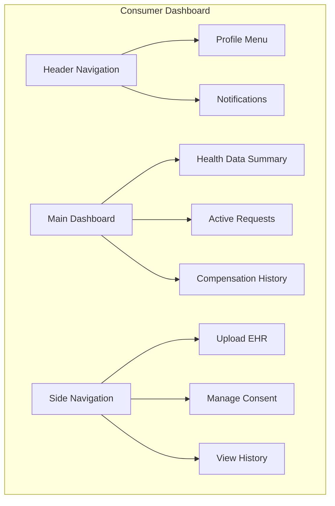
```mermaid
graph TD
    subgraph Consumer Dashboard
        A[Header Navigation] --> B[Profile Menu]
        A --> C[Notifications]
        D[Main Dashboard] --> E[Health Data Summary]
        D --> F[Active Requests]
        D --> G[Compensation History]
        H[Side Navigation] --> I[Upload EHR]
        H --> J[Manage Consent]
        H --> K[View History]
    end
```

| Component | Description | Key Features |
|-----------|-------------|--------------|
| Header | Global navigation bar | Profile, notifications, search |
| Dashboard | Data overview panel | Charts, statistics, alerts |
| Side Menu | Quick access navigation | Upload, consent, history |
| Data Grid | Health record display | Filtering, sorting, export |
| Consent Panel | Permission management | Grant/revoke access |

#### 5.1.2 Company Portal Layout

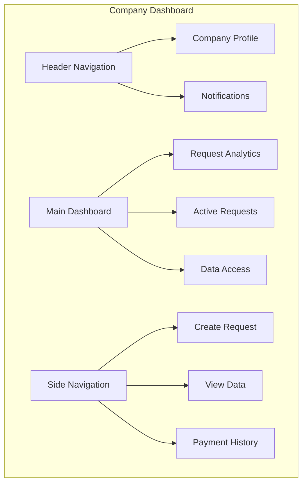
```mermaid
graph TD
    subgraph Company Dashboard
        A[Header Navigation] --> B[Company Profile]
        A --> C[Notifications]
        D[Main Dashboard] --> E[Request Analytics]
        D --> F[Active Requests]
        D --> G[Data Access]
        H[Side Navigation] --> I[Create Request]
        H --> J[View Data]
        H --> K[Payment History]
    end
```

### 5.2 DATABASE DESIGN

#### 5.2.1 Core Data Models

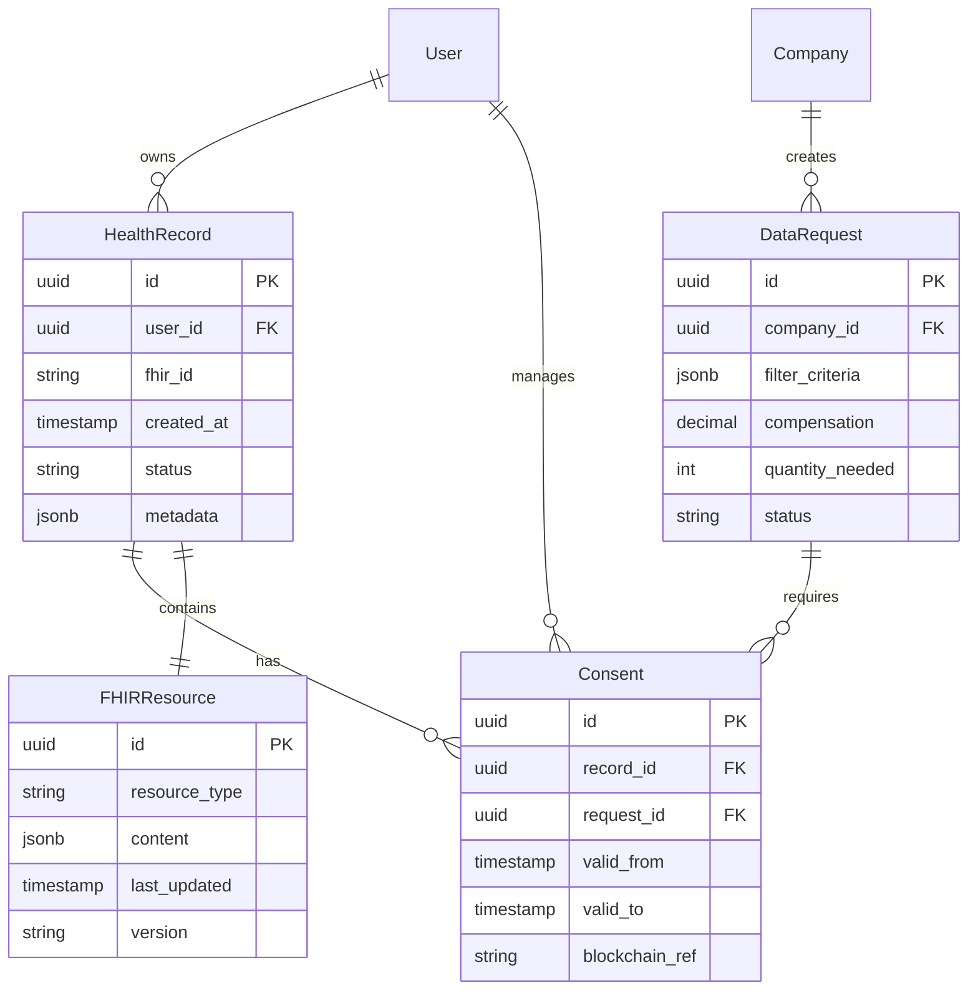
```mermaid
erDiagram
    HealthRecord ||--o{ Consent : has
    HealthRecord ||--|| FHIRResource : contains
    User ||--o{ HealthRecord : owns
    User ||--o{ Consent : manages
    Company ||--o{ DataRequest : creates
    DataRequest ||--o{ Consent : requires
    
    HealthRecord {
        uuid id PK
        uuid user_id FK
        string fhir_id
        timestamp created_at
        string status
        jsonb metadata
    }

    FHIRResource {
        uuid id PK
        string resource_type
        jsonb content
        timestamp last_updated
        string version
    }

    Consent {
        uuid id PK
        uuid record_id FK
        uuid request_id FK
        timestamp valid_from
        timestamp valid_to
        string blockchain_ref
    }

    DataRequest {
        uuid id PK
        uuid company_id FK
        jsonb filter_criteria
        decimal compensation
        int quantity_needed
        string status
    }
```

#### 5.2.2 Data Storage Strategy

| Storage Type | Technology | Purpose | Data Type |
|--------------|------------|----------|-----------|
| FHIR Data | Medplum | Health Records | FHIR Resources |
| Metadata | MongoDB | User/Company Data | JSON Documents |
| Blockchain | Hyperledger | Transactions | Chain Code |
| Cache | Redis | Session Data | Key-Value Pairs |

### 5.3 API DESIGN

#### 5.3.1 API Architecture

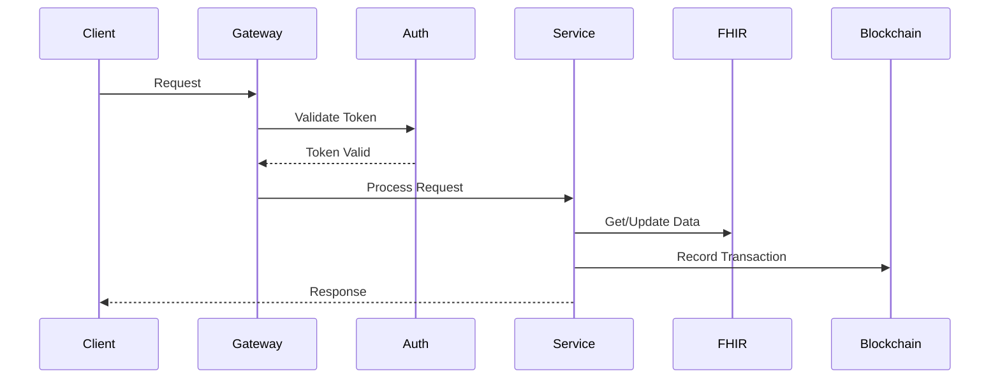
```mermaid
sequenceDiagram
    participant Client
    participant Gateway
    participant Auth
    participant Service
    participant FHIR
    participant Blockchain

    Client->>Gateway: Request
    Gateway->>Auth: Validate Token
    Auth-->>Gateway: Token Valid
    Gateway->>Service: Process Request
    Service->>FHIR: Get/Update Data
    Service->>Blockchain: Record Transaction
    Service-->>Client: Response
```

#### 5.3.2 API Endpoints

| Category | Endpoint | Method | Purpose |
|----------|----------|--------|----------|
| Health Records | /api/v1/records | POST | Upload EHR |
| Health Records | /api/v1/records/{id} | GET | Retrieve Record |
| Consent | /api/v1/consent | POST | Grant Consent |
| Consent | /api/v1/consent/{id} | DELETE | Revoke Consent |
| Marketplace | /api/v1/requests | POST | Create Request |
| Marketplace | /api/v1/requests/{id}/match | GET | Find Matches |

#### 5.3.3 Integration Patterns

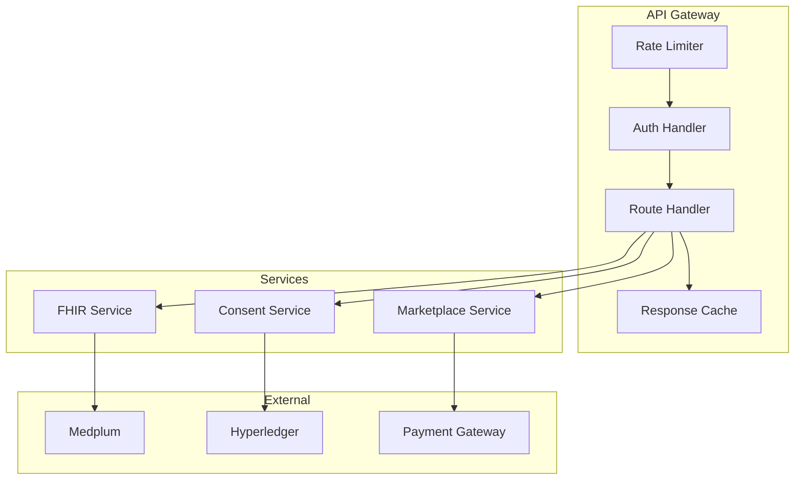
```mermaid
flowchart TD
    subgraph API Gateway
        A[Rate Limiter] --> B[Auth Handler]
        B --> C[Route Handler]
        C --> D[Response Cache]
    end

    subgraph Services
        E[FHIR Service]
        F[Consent Service]
        G[Marketplace Service]
    end

    subgraph External
        H[Medplum]
        I[Hyperledger]
        J[Payment Gateway]
    end

    C --> E & F & G
    E --> H
    F --> I
    G --> J
```

#### 5.3.4 API Security Controls

| Control | Implementation | Purpose |
|---------|----------------|----------|
| Authentication | JWT + OAuth2 | Identity Verification |
| Authorization | RBAC + ABAC | Access Control |
| Rate Limiting | Token Bucket | Request Throttling |
| Encryption | TLS 1.3 | Data Protection |
| Validation | JSON Schema | Input Verification |

## 6. USER INTERFACE DESIGN

### 6.1 Consumer Portal Wireframes

#### 6.1.1 Dashboard View
```
+----------------------------------------------------------+
|  MyElixir [@]Account [#]Dashboard [=]Settings [?]Help     |
+----------------------------------------------------------+
|                                                           |
|  Welcome back, John Smith                    [!]2 Alerts  |
|                                                           |
|  +-------------------+  +----------------------+          |
|  | Health Records    |  | Active Requests      |         |
|  | [^]Upload EHR     |  | [$]5 Matching        |         |
|  | [i]12 Records     |  | [*]3 New             |         |
|  +-------------------+  +----------------------+          |
|                                                          |
|  +-------------------+  +----------------------+         |
|  | Consent Status    |  | Compensation         |         |
|  | [*]4 Active       |  | [$]Total: $520       |         |
|  | [!]2 Pending      |  | [i]Last: $50         |         |
|  +-------------------+  +----------------------+         |
|                                                          |
|  [Recent Activity]                                       |
|  +--------------------------------------------------+   |
|  | 05/15 - Data shared with PharmaCorp              |   |
|  | 05/14 - New request match from HealthStudy Inc    |   |
|  | 05/13 - Received compensation: $50               |   |
|  +--------------------------------------------------+   |
+----------------------------------------------------------+
```

#### 6.1.2 EHR Upload Interface
```
+----------------------------------------------------------+
|  [<]Back to Dashboard                     [@]John Smith    |
+----------------------------------------------------------+
|                                                           |
|  Upload Health Records                    [?]FHIR Guide   |
|  +--------------------------------------------------+    |
|  |  [^] Drag and drop files here                     |    |
|  |      or                                           |    |
|  |  [Choose Files]                                   |    |
|  +--------------------------------------------------+    |
|                                                           |
|  Supported Formats:                                       |
|  ( ) FHIR JSON                                           |
|  ( ) FHIR XML                                            |
|  ( ) PDF Document                                        |
|                                                          |
|  Processing Options:                                      |
|  [x] Auto-validate FHIR format                           |
|  [x] Extract searchable metadata                         |
|  [ ] Apply default sharing preferences                   |
|                                                          |
|  [Upload and Process]  [Cancel]                          |
|                                                          |
|  Upload Progress:                                        |
|  [====================================]  75%            |
+----------------------------------------------------------+
```

### 6.2 Company Portal Wireframes

#### 6.2.1 Data Request Creation
```
+----------------------------------------------------------+
|  [<]Requests  [#]Analytics  [$]Billing  [@]Company        |
+----------------------------------------------------------+
|                                                           |
|  Create New Data Request                [?]Request Guide  |
|  +--------------------------------------------------+    |
|  | Request Details                                    |    |
|  | Title: [..............................]            |    |
|  | Description: [.................................]   |    |
|  |                                                    |    |
|  | Filter Criteria:                                   |    |
|  | +----------------+  +-------------------+          |    |
|  | | Demographics   |  | Health Conditions |          |    |
|  | | [v]Age Range   |  | [+]Add Condition  |          |    |
|  | | [v]Gender      |  | [*]2 Selected     |          |    |
|  | +----------------+  +-------------------+          |    |
|  |                                                    |    |
|  | Compensation:                                      |    |
|  | Price per record: [$][........]                   |    |
|  | Records needed:   [..........]                    |    |
|  |                                                    |    |
|  | [Preview Matches]  [Submit Request]                |    |
|  +--------------------------------------------------+    |
+----------------------------------------------------------+
```

### 6.3 UI Component Key

#### Navigation Elements
- [@] User/Profile menu
- [#] Dashboard access
- [=] Settings menu
- [?] Help/Documentation
- [<] Back navigation
- [>] Forward/Next

#### Action Icons
- [+] Add/Create new
- [x] Close/Delete/Remove
- [^] Upload functionality
- [$] Financial/Payment related
- [!] Alerts/Warnings
- [*] Important/Featured items
- [i] Information indicator

#### Input Elements
- [...] Text input field
- [ ] Checkbox
- ( ) Radio button
- [v] Dropdown menu
- [====] Progress indicator
- [Button] Action button

### 6.4 Responsive Design Breakpoints

| Breakpoint | Width | Layout Changes |
|------------|-------|----------------|
| Mobile | <768px | Single column, stacked panels |
| Tablet | 768-1024px | Two column, condensed panels |
| Desktop | >1024px | Full layout, expanded panels |

### 6.5 Color Scheme

| Element | Color Code | Usage |
|---------|------------|-------|
| Primary | #2196F3 | Headers, buttons |
| Secondary | #FFC107 | Alerts, highlights |
| Success | #4CAF50 | Confirmations |
| Warning | #FF9800 | Warnings |
| Error | #F44336 | Error messages |
| Text | #212121 | Primary text |
| Background | #FFFFFF | Main background |

### 6.6 Typography

| Element | Font | Size | Weight |
|---------|------|------|--------|
| Headers | Roboto | 24px | 500 |
| Body | Open Sans | 16px | 400 |
| Buttons | Roboto | 14px | 500 |
| Labels | Open Sans | 12px | 400 |
| Alerts | Roboto | 14px | 500 |

### 6.7 Accessibility Features

- ARIA labels on all interactive elements
- Keyboard navigation support
- High contrast mode support
- Screen reader compatibility
- Minimum touch target size 44x44px
- Color contrast ratio minimum 4.5:1

# 7. SECURITY CONSIDERATIONS

## 7.1 AUTHENTICATION AND AUTHORIZATION

### 7.1.1 Authentication Flow

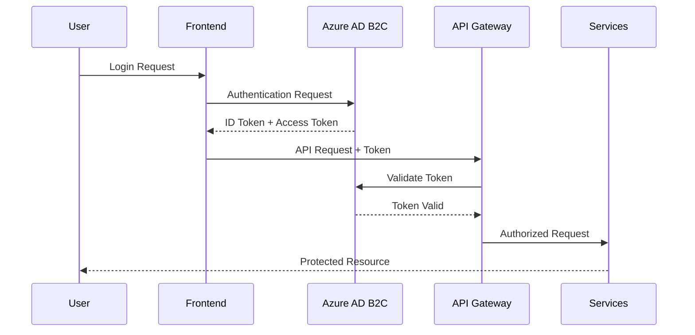
```mermaid
sequenceDiagram
    participant User
    participant Frontend
    participant Azure AD B2C
    participant API Gateway
    participant Services

    User->>Frontend: Login Request
    Frontend->>Azure AD B2C: Authentication Request
    Azure AD B2C-->>Frontend: ID Token + Access Token
    Frontend->>API Gateway: API Request + Token
    API Gateway->>Azure AD B2C: Validate Token
    Azure AD B2C-->>API Gateway: Token Valid
    API Gateway->>Services: Authorized Request
    Services-->>User: Protected Resource
```

### 7.1.2 Authorization Matrix

| Role | Data Access | Consent Management | Marketplace | Admin Functions |
|------|-------------|-------------------|-------------|-----------------|
| Consumer | Own records only | Manage own consent | View requests | None |
| Company | Purchased data only | Request consent | Create requests | None |
| Admin | All records | Override consent | Manage marketplace | Full access |
| System | Backend only | Automated consent | Match requests | Maintenance |

### 7.1.3 MFA Implementation

| Factor Type | Implementation | Use Case |
|------------|----------------|-----------|
| Primary | Password + Email | Standard login |
| Secondary | SMS/Authenticator App | High-risk operations |
| Biometric | Mobile device biometrics | Mobile app access |
| Recovery | Backup codes | Account recovery |

## 7.2 DATA SECURITY

### 7.2.1 Encryption Strategy

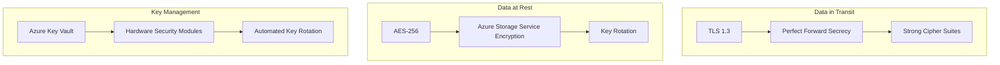
```mermaid
flowchart TD
    subgraph Data in Transit
        A[TLS 1.3] --> B[Perfect Forward Secrecy]
        B --> C[Strong Cipher Suites]
    end

    subgraph Data at Rest
        D[AES-256] --> E[Azure Storage Service Encryption]
        E --> F[Key Rotation]
    end

    subgraph Key Management
        G[Azure Key Vault] --> H[Hardware Security Modules]
        H --> I[Automated Key Rotation]
    end
```

### 7.2.2 Data Classification

| Classification | Examples | Security Controls |
|----------------|----------|------------------|
| PHI/PII | Health records, SSN | Field-level encryption, audit logging |
| Financial | Payment data | PCI DSS compliance, tokenization |
| Metadata | Usage statistics | Standard encryption |
| Public | Marketing content | Basic protection |

### 7.2.3 Access Controls

| Resource Type | Access Method | Protection Mechanism |
|---------------|---------------|---------------------|
| FHIR Records | API Gateway | OAuth 2.0 + RBAC |
| Blockchain Data | Smart Contracts | Digital signatures |
| User Profiles | Direct API | JWT + Session management |
| System Config | Admin API | MFA + IP whitelist |

## 7.3 SECURITY PROTOCOLS

### 7.3.1 Network Security

```mermaid
flowchart LR
    subgraph External Zone
        A[WAF] --> B[DDoS Protection]
        B --> C[Load Balancer]
    end

    subgraph DMZ
        C --> D[API Gateway]
        D --> E[Authentication]
    end

    subgraph Internal Zone
        E --> F[Application Services]
        F --> G[Database]
    end
```

### 7.3.2 Security Monitoring

| Component | Monitoring Type | Alert Threshold |
|-----------|----------------|-----------------|
| WAF | Request analysis | >100 blocked requests/min |
| API Gateway | Rate limiting | >1000 requests/min/IP |
| Authentication | Failed attempts | >5 failures/10 min/user |
| Database | Access patterns | Unusual query patterns |

### 7.3.3 Compliance Controls

| Requirement | Implementation | Validation |
|-------------|----------------|------------|
| HIPAA | PHI encryption, access logs | Quarterly audit |
| GDPR | Data privacy controls | Annual assessment |
| HITECH | Breach notification | Automated alerts |
| SOC 2 | Security controls | External audit |

### 7.3.4 Incident Response

```mermaid
stateDiagram-v2
    [*] --> Detection
    Detection --> Analysis
    Analysis --> Containment
    Containment --> Eradication
    Eradication --> Recovery
    Recovery --> PostIncident
    PostIncident --> [*]

    state Detection {
        [*] --> AlertTriggered
        AlertTriggered --> IncidentLogged
    }

    state Analysis {
        [*] --> ThreatAssessment
        ThreatAssessment --> ImpactAnalysis
    }

    state Containment {
        [*] --> IsolateSystem
        IsolateSystem --> SecureEvidence
    }
```

### 7.3.5 Security Testing

| Test Type | Frequency | Coverage |
|-----------|-----------|----------|
| Penetration Testing | Quarterly | External interfaces |
| Vulnerability Scan | Weekly | All systems |
| Code Security Review | Per release | Application code |
| Configuration Audit | Monthly | Infrastructure |

# 8. INFRASTRUCTURE

## 8.1 DEPLOYMENT ENVIRONMENT

```mermaid
flowchart TD
    subgraph Production Environment
        A[Azure Cloud] --> B[Primary Region]
        A --> C[Secondary Region]
        B --> D[AKS Production Cluster]
        C --> E[AKS DR Cluster]
    end

    subgraph Staging Environment
        F[Azure Cloud] --> G[Staging Region]
        G --> H[AKS Staging Cluster]
    end

    subgraph Development Environment
        I[Azure Cloud] --> J[Dev Region]
        J --> K[AKS Dev Cluster]
    end
```

| Environment | Purpose | Configuration | Region |
|------------|---------|---------------|---------|
| Production | Live system | High-availability, Multi-region | East US (Primary), West US (DR) |
| Staging | Pre-production testing | Production-like | Central US |
| Development | Development testing | Minimal resources | East US 2 |
| Local | Developer environments | Minikube/Docker Desktop | N/A |

## 8.2 CLOUD SERVICES

### Core Azure Services

| Service | Purpose | Justification |
|---------|----------|--------------|
| Azure Kubernetes Service (AKS) | Container orchestration | Managed Kubernetes with HIPAA compliance |
| Azure Container Registry | Container image registry | Private, geo-replicated image storage |
| Azure Monitor | Monitoring and logging | Integrated monitoring for AKS and applications |
| Azure Key Vault | Secrets management | FIPS 140-2 Level 2 validated HSM |
| Azure AD B2C | Identity management | Enterprise-grade identity with MFA support |
| Azure CDN | Content delivery | Global content distribution |

### Storage Services

| Service | Use Case | Configuration |
|---------|----------|--------------|
| Azure Blob Storage | Document storage | Geo-redundant, encrypted at rest |
| Azure Managed Disks | Container storage | Premium SSD for performance |
| Azure Files | Shared storage | SMB 3.0 protocol support |
| Azure Backup | Data backup | 7-year retention policy |

## 8.3 CONTAINERIZATION

```mermaid
flowchart LR
    subgraph Container Architecture
        A[Base Images] --> B[Service Images]
        B --> C[Runtime Images]
    end

    subgraph Base Images
        D[node:18-alpine]
        E[nginx:alpine]
    end

    subgraph Service Images
        F[API Services]
        G[Frontend]
        H[Background Jobs]
    end

    D --> F & H
    E --> G
```

### Docker Configuration

| Component | Base Image | Optimization |
|-----------|------------|--------------|
| API Services | node:18-alpine | Multi-stage builds |
| Frontend | nginx:alpine | Static asset optimization |
| Background Jobs | node:18-alpine | Minimal dependencies |
| FHIR Proxy | nginx:alpine | Custom security headers |

## 8.4 ORCHESTRATION

```mermaid
flowchart TD
    subgraph AKS Cluster
        A[Ingress Controller] --> B[API Gateway]
        B --> C[Service Mesh]
        C --> D[Application Pods]
        C --> E[Background Jobs]
    end

    subgraph Kubernetes Resources
        F[Deployments]
        G[Services]
        H[ConfigMaps]
        I[Secrets]
    end

    D --> F & G
    E --> F & G
    D & E --> H & I
```

### Kubernetes Configuration

| Resource Type | Purpose | Configuration |
|--------------|---------|---------------|
| Namespaces | Environment isolation | prod, staging, dev |
| Deployments | Application management | Rolling updates, auto-scaling |
| Services | Network exposure | Internal/External load balancing |
| ConfigMaps | Configuration | Environment-specific settings |
| Secrets | Sensitive data | Azure Key Vault integration |

## 8.5 CI/CD PIPELINE

```mermaid
flowchart LR
    subgraph CI Pipeline
        A[Source Code] --> B[Build]
        B --> C[Test]
        C --> D[Security Scan]
        D --> E[Container Build]
    end

    subgraph CD Pipeline
        E --> F[Dev Deploy]
        F --> G[Staging Deploy]
        G --> H[Production Deploy]
    end

    subgraph Quality Gates
        I[Unit Tests]
        J[Integration Tests]
        K[Security Checks]
        L[Performance Tests]
    end

    C --> I & J
    D --> K
    G --> L
```

### Pipeline Stages

| Stage | Tools | Actions |
|-------|-------|---------|
| Build | GitHub Actions | Code compilation, dependency check |
| Test | Jest, Cypress | Unit tests, integration tests |
| Security | SonarQube, OWASP | Code analysis, vulnerability scan |
| Package | Docker, ACR | Container image build and push |
| Deploy | Helm, Flux | Automated deployment |

### Deployment Strategy

| Environment | Strategy | Validation |
|------------|----------|------------|
| Development | Direct deployment | Basic smoke tests |
| Staging | Blue/Green | Full test suite |
| Production | Canary | Progressive traffic shift |

# APPENDICES

## A.1 ADDITIONAL TECHNICAL INFORMATION

### A.1.1 Background Job Specifications

| Job Name | Schedule | Queue Priority | Retry Policy |
|----------|----------|----------------|--------------|
| process-request | Event-driven | High | 3 attempts, exponential backoff |
| notify-consumer-request | Real-time | Medium | 2 attempts, 5min delay |
| notify-consumer-data-shared | Real-time | Medium | 2 attempts, 5min delay |
| notify-company-request-met | Real-time | Medium | 2 attempts, 5min delay |

### A.1.2 Data Processing Pipeline

```mermaid
flowchart TD
    subgraph Data Ingestion
        A[EHR Upload] --> B[FHIR Validation]
        B --> C[Data Classification]
        C --> D[Metadata Extraction]
    end

    subgraph Processing Layer
        D --> E[Filter Matching]
        E --> F[Consent Verification]
        F --> G[Data Transformation]
    end

    subgraph Distribution
        G --> H[Company Access]
        G --> I[Blockchain Record]
        G --> J[Payment Processing]
    end
```

### A.1.3 System Integration Points

| Integration | Protocol | Authentication | Rate Limits |
|-------------|----------|----------------|-------------|
| Medplum FHIR | REST/HTTPS | OAuth 2.0 + JWT | 1000 req/min |
| Hyperledger | gRPC | TLS Certificates | 500 tx/min |
| Azure AD B2C | OpenID Connect | OAuth 2.0 | 100 auth/min |
| Payment Gateway | REST/HTTPS | API Keys + HMAC | 100 tx/min |

## A.2 GLOSSARY

| Term | Definition |
|------|------------|
| Access Token | Credential used to access protected resources |
| Blockchain | Distributed ledger technology used for transaction records |
| Chain Code | Smart contract implementation in Hyperledger Fabric |
| Data Consumer | Healthcare company requesting access to health records |
| Data Provider | Individual sharing their health records |
| EHR | Electronic Health Record |
| FHIR Resource | Standardized healthcare data format |
| Filter Criteria | Parameters used to match health records with requests |
| Marketplace | Platform facilitating health data exchange |
| Smart Contract | Self-executing contract with encoded terms |

## A.3 ACRONYMS

| Acronym | Full Form |
|---------|-----------|
| AKS | Azure Kubernetes Service |
| API | Application Programming Interface |
| B2C | Business to Consumer |
| CDN | Content Delivery Network |
| EHR | Electronic Health Record |
| FHIR | Fast Healthcare Interoperability Resources |
| GDPR | General Data Protection Regulation |
| gRPC | Google Remote Procedure Call |
| HIPAA | Health Insurance Portability and Accountability Act |
| HITECH | Health Information Technology for Economic and Clinical Health Act |
| HMAC | Hash-based Message Authentication Code |
| HSM | Hardware Security Module |
| JWT | JSON Web Token |
| MFA | Multi-Factor Authentication |
| RBAC | Role-Based Access Control |
| REST | Representational State Transfer |
| SDK | Software Development Kit |
| SSL | Secure Sockets Layer |
| TLS | Transport Layer Security |
| WCAG | Web Content Accessibility Guidelines |
| WSS | WebSocket Secure |

## A.4 SYSTEM MONITORING METRICS

```mermaid
flowchart LR
    subgraph Performance Metrics
        A[Response Time] --> B[API Latency]
        A --> C[Database Queries]
        A --> D[Blockchain Transactions]
    end

    subgraph Health Metrics
        E[Service Status] --> F[Pod Health]
        E --> G[Database Connections]
        E --> H[Memory Usage]
    end

    subgraph Business Metrics
        I[Transaction Volume] --> J[Active Users]
        I --> K[Data Requests]
        I --> L[Success Rate]
    end
```

## A.5 ERROR CODES AND HANDLING

| Error Code | Description | Handling Strategy |
|------------|-------------|------------------|
| AUTH-001 | Authentication Failed | Redirect to login |
| AUTH-002 | Token Expired | Refresh token flow |
| FHIR-001 | Invalid FHIR Resource | Validation feedback |
| FHIR-002 | Resource Not Found | Cache check, then 404 |
| CONS-001 | Invalid Consent | Notify user for update |
| CONS-002 | Expired Consent | Auto-revocation |
| PAY-001 | Payment Failed | Retry with backoff |
| SYS-001 | System Overload | Circuit breaker trigger |